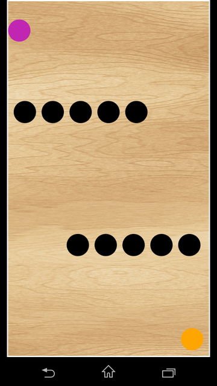
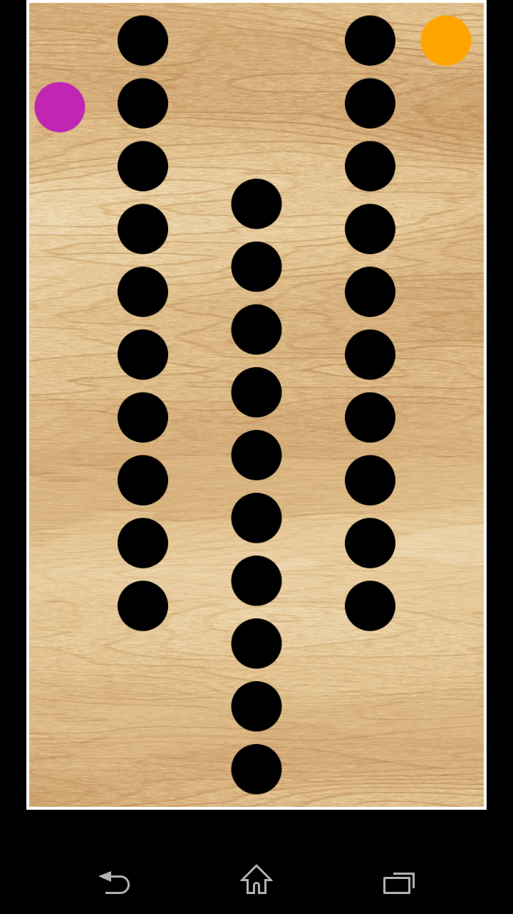
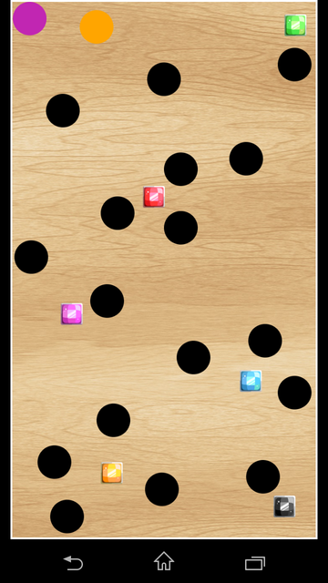
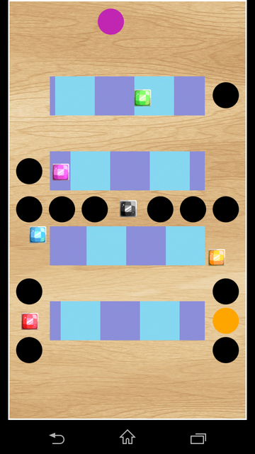
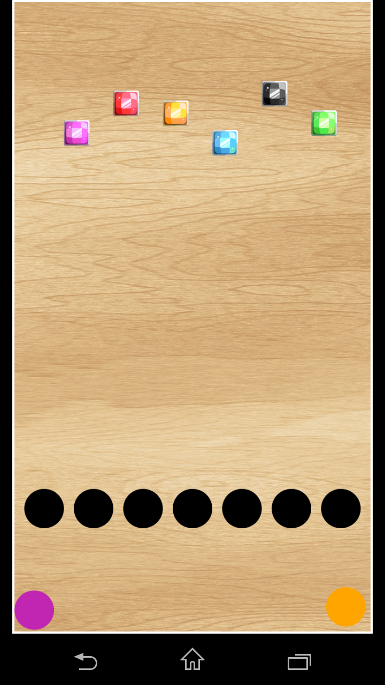
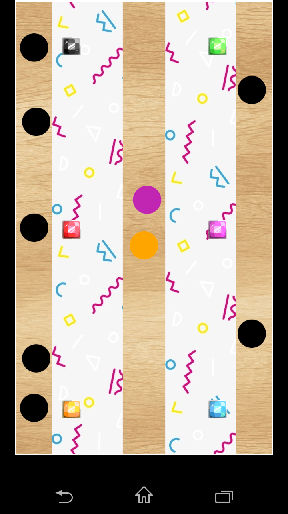
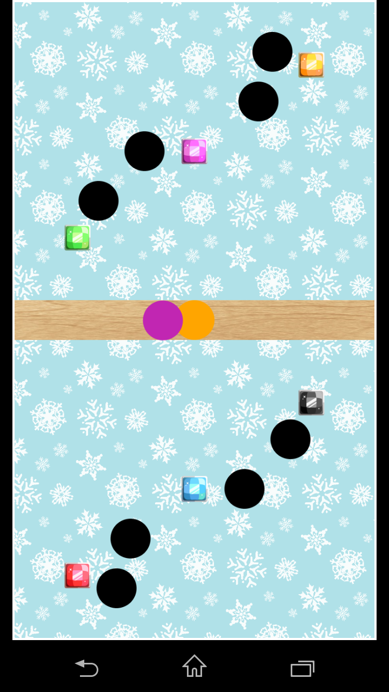
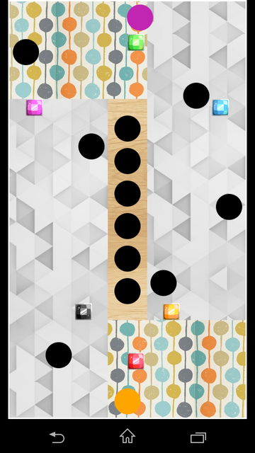
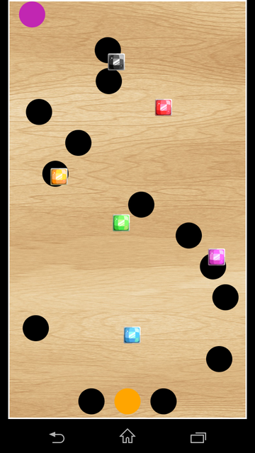

# Marble
Marble is a mobile game created in vanilla javascript

## How to play
This game is designed for touch screen devices with gyroscope.
Use touch screen to navigate in menu.
Tilt your device to control the ball.
Go to the orange circle to finish a level and unlock the next one.
Avoid the black holes.
Levels 3-9 require you to collect gems that activate the exit.

## Features
* 9 different levels
* Displaying time of your run
* Level selection menu
* A list of your best runs
* Auto-saving your game progress and records in local storage
* Pause game by touching the screen

## Levels
### Level 1

### Level 2

### Level 3

### Level 4

### Level 5

### Level 6

### Level 7

### Level 8

### Level 9

